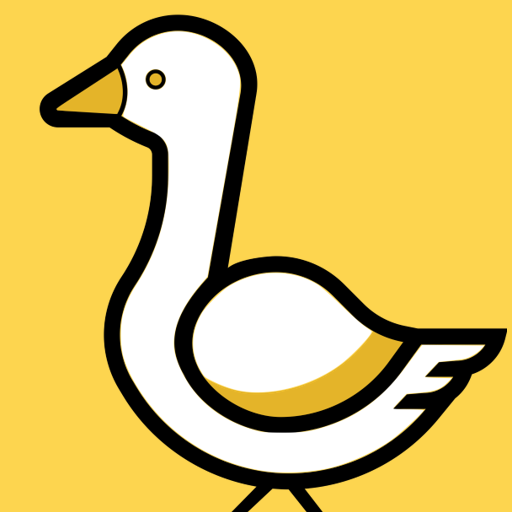

# Goose :iphone:

 

<!--or https://github.com/Raymo111/Goose/releases/download/v1.0/Goose.v1.0.apk

-->

UWaterloo Goose Android App. Unleash your inner goose!

*The idea for this app originated from the UW CS 225% Discord Server who wanted a goose app on Google Play.*

*All images used are from [PixaBay](https://pixabay.com).*

*Thanks to arcana for testing and moral support!*
